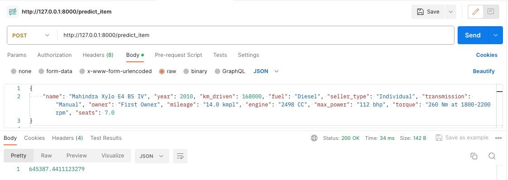
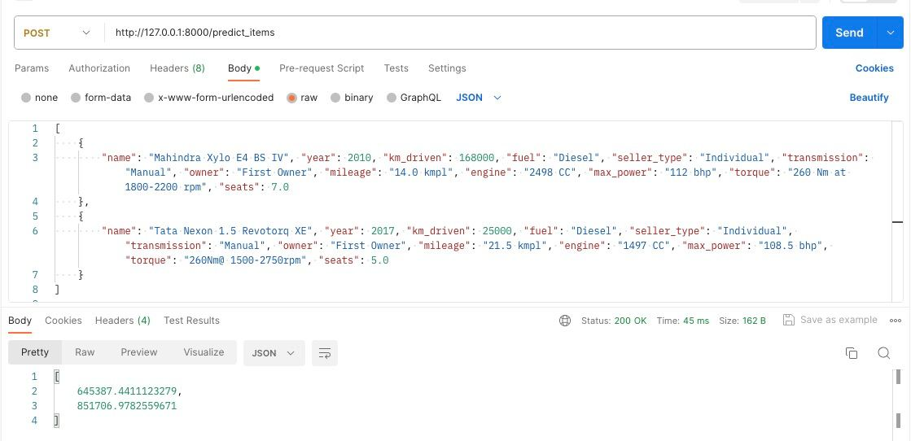
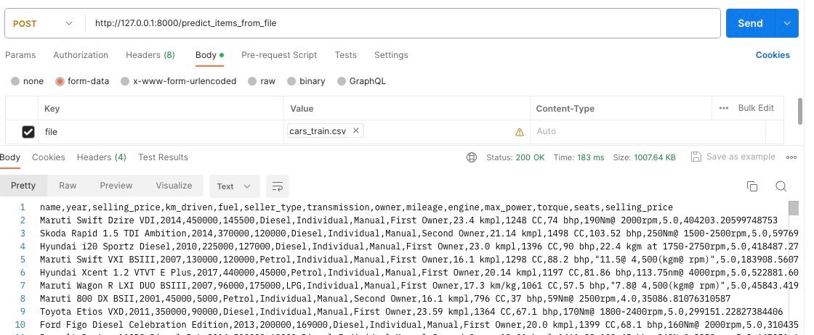

# Сервис предсказания цен на автомобили

Этот репозиторий представляет собой сервис для предсказания цен на автомобили на основе их характеристик. Проект выполнен в качестве домашнего задания по курсу "Машинное Обучение" в рамках магистерской программы МОВС.  
Включает в себя ноутбук с исследованием для выбора наилучшей модели предсказания и веса этой модели, используемые в сервисе.

## Обзор

### Цель проекта
Разработка модели для предсказания цен на автомобили, основываясь на их характеристиках.

### Состав репозитория
- Ноутбук с кодом исследования для выбора модели
- Веса выбранной модели
- Сервис на FastAPI для предсказания цен

## Исследование данных (EDA)

### Описание датасета
Датасет содержит следующие признаки:
- `name` - название
- `year` - год
- `km_driven` - пробег
- `fuel` - тип топлива
- `seller_type` - тип продавца
- `transmission` - коробка передач
- `owner` - владелец
- `mileage` - расход топлива
- `engine` - двигатель
- `max_power` - максимальная мощность
- `torque` - крутящий момент
- `seats` - количество мест
- `selling price` - цена (целевая переменная)

### Основные выводы EDA
- Датасет: ~7000 записей в тренировочном и 1000 в тестовом
- Наличие пропущенных значений и дубликатов
- Выявлены зависимости между признаками и целевой переменной
- Предобработка: заполнение пропусков, удаление дубликатов, преобразование текстовых признаков

## Выбор модели

### Тестирование моделей
Протестированы различные линейные модели:

| Модель | R^2 | Описание |
|----------|----------|----------|
| Линейная регрессия | 0.59 | Без регулиризации, вещественные признаки|
| Lasso | 0.56 | С L1 регулиризацией, , вещественные признаки|
| ElasticNet | 0.56 | С L1 и L2 регулиризацией, , вещественные признаки|
| **Ridge** | **0.61** | **С L2 регулиризацией, вещественные и категориальные признаки*** |

\* One-Hot Encoding для категориальных признаков  

#### Лучший результат показала модель Ridge.  


### Оптимизация модели

- Гиперпараметры модели подбирались используя GridSearch с валидацией в 10 фолдов

## Бизнес-метрика
- Доля предсказаний с отклонением не более 10% от реальной цены: **25.4%** для лучшей модели

## Реализация сервиса

### Описание микросервиса
Сервис на FastAPI для предсказания цен, использующий модель Ridge.

### API Endpoints
1. `/predict_item` - POST запрос для одиночного предсказания  
   - Пример запроса:
     ```json
     {
         "name": "Mahindra Xylo E4 BS IV", "year": 2010, "km_driven": 168000, ...
     }
     ```


2. `/predict_items` - POST запрос для множественных предсказаний
   - Пример запроса:
     ```json
     [
         {"name": "Mahindra Xylo E4 BS IV", "year": 2010, "km_driven": 168000, ...},
         {"name": "Tata Nexon 1.5 Revotorq XE", "year": 2017, "km_driven": 25000, ...}
     ]
     ```

3. `/predict_items_from_file` - POST запрос для предсказаний из CSV файла
   - Пример файла:
     ```csv
     name,year,km_driven,fuel,seller_type,transmission,owner,mileage,engine,max_power,torque,seats
     Maruti Swift Dzire VDI,2014,145500,Diesel,Individual,Manual,First Owner,23.4 kmpl,1248 CC,74 bhp,190Nm@ 2000rpm,5.0
     ...
     ```


## Скрины работы сервиса

  


## Планы на будущее
- Улучшение качества данных: анализ и обработка выбросо, изменение логики заполнения пропусков
- Разработка новых признаков на основе существующих данных и внешних источников
- Пересмотр стратегии оптимизации гиперпараметров
- Развертывание сервиса на публичном хостинге
